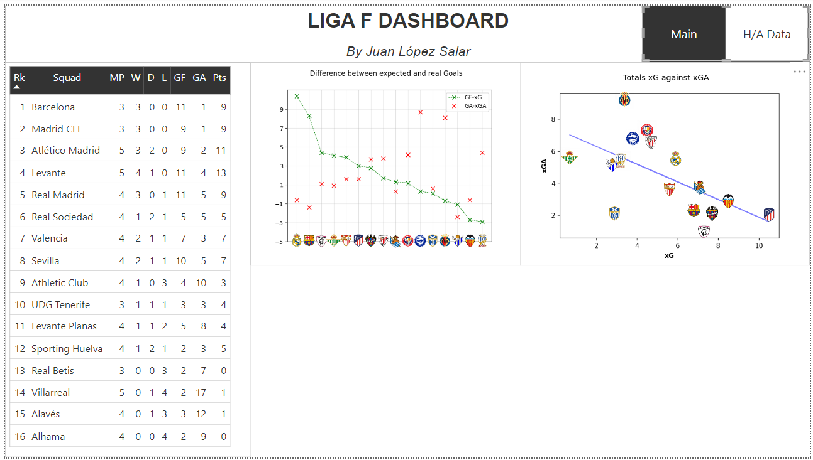
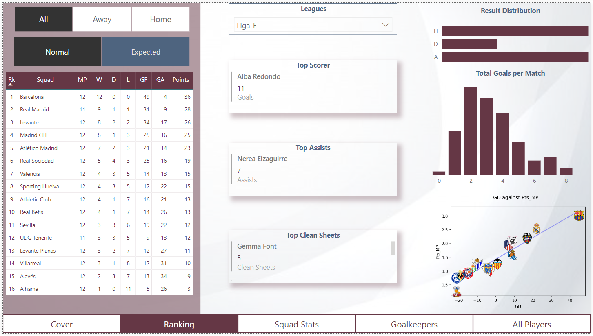
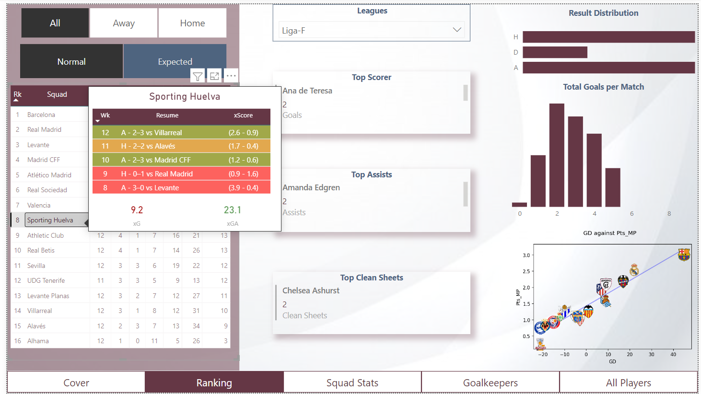
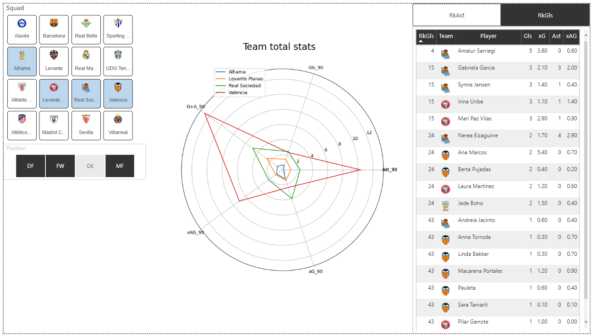

# futfem-analytics

This repository is a personal project that combines two of my passions: *football* and *data*.
It is used to learn about Data Analytics processing using *Python* as the main language to get the data and Power BI as data visualization tool. 

## The Data
All the data used in this repository comes from *FBref* ([see FBref](https://fbref.com/en/)). In this case, given the huge amount of people working on Male Leagues, I decided to use the *Female Spanish First Division* ([on FBref](https://fbref.com/en/comps/230/Liga-F-Stats)).

## The Dashboard
*In construction...*
Some of the metrics used in the analysis:
- *xGoals*, *xGA* and *nPxG*
- *GoalDiff (and xGDiff) per 90 minutes*
- *Points per 90 minutes*

Actual version of the dashboard:
|||
|---|---|
|  |  |
|  |  |