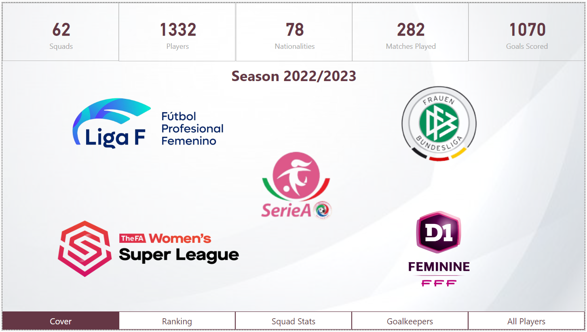

# futfem-analytics

This repository is a personal project that combines two of my passions: *football* and *data*.
It is used to learn about Data Analytics processing using *Python* as the main language to get the data and *Power BI* as data visualization tool. 

## The Data
All the data used in this repository comes from *FBref* ([see FBref](https://fbref.com/en/)). In this case, given the huge amount of people working on Male Leagues, I decided to use the *Female Spanish First Division* ([on FBref](https://fbref.com/en/comps/230/Liga-F-Stats)) as base, but I expanded this data to the *Big 5 European Leagues*, including support for *Women's Super League*, *Frauen Bundesliga*, *Division 1 Fèminin* and *Serie A*. In the folder *datasets* there are example of the different types of data scrapped.

## The Dashboard

To understand the selection of some KPIs used, it is very important to know some of the metrics used in the analysis:
- *xGoals*, *xGA* and *npxG*: based on the shots of a team (made/received), it is possible to calculate the probability of each shot to end up as Goal.
- *GoalDiff (and xGDiff)*: the difference between Goals (and xG) scored and against tells us how a team performs in attack/defense.
- *Stats normalized per 90 minutes*: sometimes teams (or players) have played different number of matches (due to postponed matches, injuries, ...). Using normalized data by MP drops this difference and makes easier to compare between performances.
- *xPoints*: given the calculations of *xG* for both teams in a match, there are different approaches to calculate how many points should each team have earned by their performance. In this case I am using a basic approximation described in the blog [tacticsNotAntics](https://tacticsnotantics.org/statistical-models-and-analyses/expected-points-models-part-i/)

## Project dependencies
The libraries required are:
- numpy, pandas
- requests, beautyfulSoup
- mplsoccer: for radar charts

Actual version of the dashboard:
|  |  |
|---|---|
|  |  |
|  |  |
